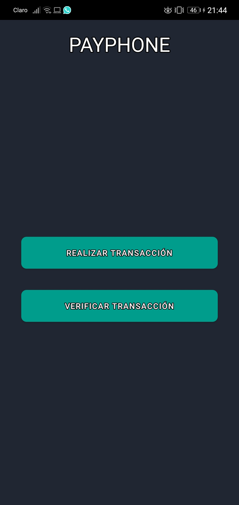
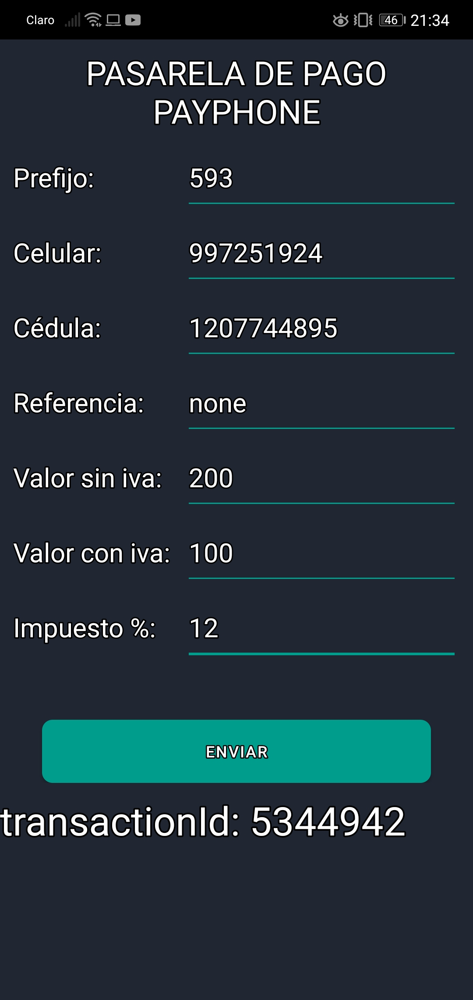
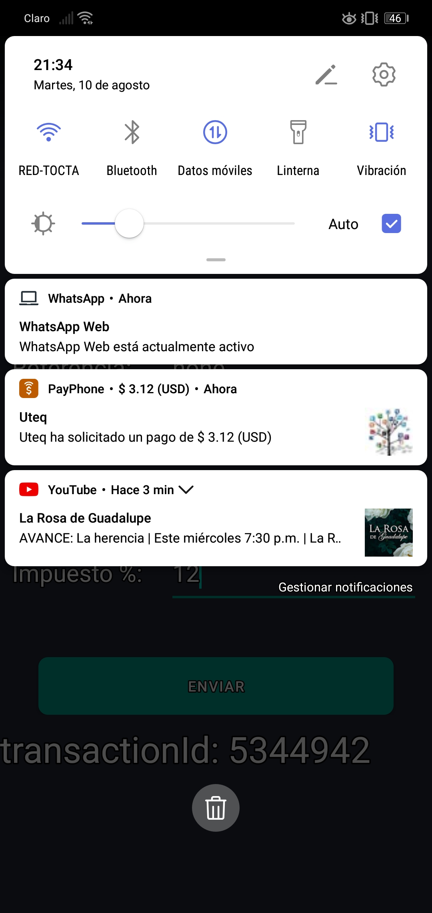
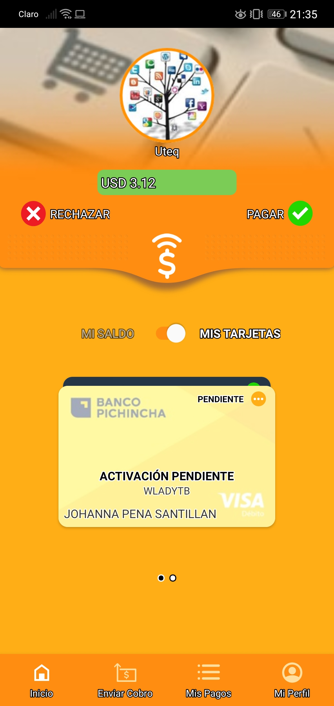
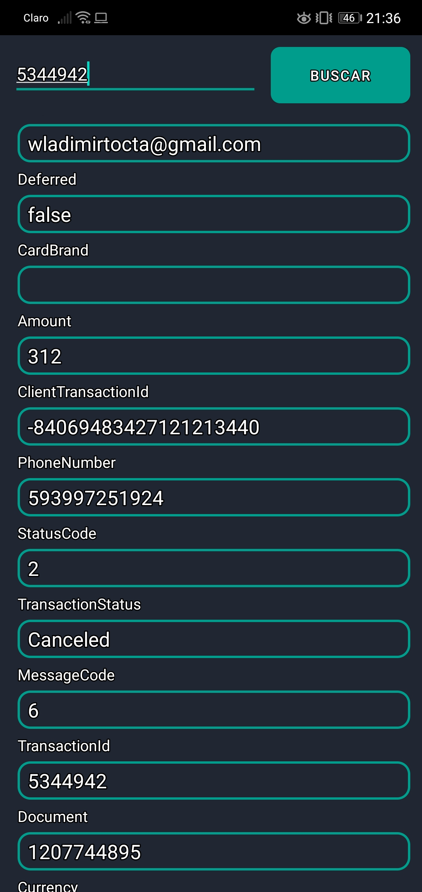

# PASARELA-DE-PAGO-PAYPHONE
<h1>PASARELA DE PAGO PAYPHONE</h1>
<h3>iMPLEMENTACIÓN DE LAS API REST DE LA PASARELA DE PAGO PAYPHONE</h3>
cuando se abre la aplicación el usuario tendrá la opción de consultar una trasacción o crear una  
 
para crear una transacción, el usuario deberá llenar la siguiente infomración: 
 
cuando se haya realizado la transacción, llegará una notificación al celular del cliente: 
 
al ingresar a la aplicación, en el teléfono del cliente saldrá la opción de aceptar o rechazar dicha petición de pago: 
 
Aquí se verificó la transacción realizado, y nos proporciona la siguiente información: 
 
